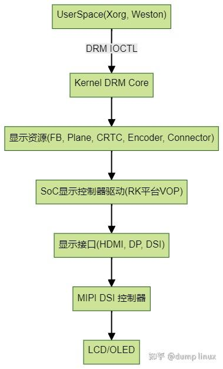

# MIPI 屏幕与显示子系统入门

**Author:** dump linux

**Date:** 2025-07-17

**Link:** https://zhuanlan.zhihu.com/p/1928107060156953391

在嵌入式 Linux 系统中，显示系统的驱动开发比串口、按键等要复杂得多，因为它涉及 **分层渲染、时序控制、硬件加速、面板控制** 等多个模块。特别是现代 SoC 常用的 **[MIPI DSI](https://zhida.zhihu.com/search?content_id=260321992&content_type=Article&match_order=1&q=MIPI+DSI&zhida_source=entity) 屏幕**，其调试门槛不低，但掌握了基本结构后也并非不可入门。

本讲将带你入门 Linux 的 **[DRM 显示子系统](https://zhida.zhihu.com/search?content_id=260321992&content_type=Article&match_order=1&q=DRM+%E6%98%BE%E7%A4%BA%E5%AD%90%E7%B3%BB%E7%BB%9F&zhida_source=entity)（Direct Rendering Manager）**，理解 **MIPI DSI 屏幕** 的工作原理，并学会在 [RK 平台](https://zhida.zhihu.com/search?content_id=260321992&content_type=Article&match_order=1&q=RK+%E5%B9%B3%E5%8F%B0&zhida_source=entity)上进行基础调试。

## **一、什么是 MIPI DSI？**

**MIPI DSI（Display Serial Interface）** 是一种高速串行显示接口，常用于连接显示控制器（如 SoC 显示子系统）与屏幕面板（如 AMOLED、IPS LCD 等），它有以下特点：

| 特点 | 描述 |
| --- | --- |
| 差分信号 | 支持高速串行通信，典型速率为 500 Mbps~1.5 Gbps |
| 通信协议 | 使用 DCS 命令（Display Command Set）配置面板 |
| 通道 | 支持 1~4 通道 Lane，影响带宽和功耗 |
| 控制方式 | 使用 DSI 主控制器（Host） 发送命令/图像帧，DSI 从设备（Panel） 接收 |

MIPI DSI 实际上是替代 RGB/LVDS 的新一代主流接口，适合分辨率高、功耗敏感的移动设备。

## **二、Linux 显示系统的基本架构（以 DRM 为核心）**

Linux 下现代显示系统使用的是 **DRM/KMS 架构**（Direct Rendering Manager / Kernel Mode Setting），它由以下核心组成：



Linux 显示系统基本架构

### **主要组成模块解释**

| 模块 | 描述 |
| --- | --- |
| DRM Core | Linux 通用图形管理子系统，提供统一的帧缓冲、刷新、事件、IOCTL 接口 |
| CRTC / Display Controller | SoC 的显示输出模块，例如 RK 的 VOP（Video Output Processor） |
| Plane | 显示控制器（如RK VOP）内部各Layer（Primary/Overlay等） |
| Framebuffer | 内存（DDR）帧缓冲区 |
| Encoder | 显示接口控制器，如 HDMI控制器、DSI控制器 |
| Connector | 物理显示接口（HDMI/DP/MIPI DSI等） |
| Panel | 面板控制器驱动，配置屏幕端的分辨率、初始化指令、背光等属性 |
| Bridge | 一些屏幕需通过转换芯片（如 MIPI 转 RGB）进行桥接 |

## **三、Rockchip 平台下的显示驱动层级**

Rockchip 使用标准 DRM 框架，并提供如下驱动：

| 模块 | 文件位置 |
| --- | --- |
| VOP 显示控制器 | drivers/gpu/drm/rockchip/rockchip_drm_vop2.c |
| MIPI-DSI 控制器 | drivers/gpu/drm/rockchip/dw-mipi-dsi2-rockchip.c |
| 面板控制器 | drivers/gpu/drm/panel/ （包含各大厂家常见面板控制器驱动） |
| Bridge 芯片 | drivers/gpu/drm/bridge/ （包含各大厂家常见桥接芯片驱动） |

你只需保证：

-   MIPI 控制器驱动正常；
-   正确的 panel 驱动或 panel-simple 配置；
-   时钟、电源、复位控制生效；
-   面板 DCS 初始化指令正确。

## **四、设备树配置：定义一个 MIPI 屏幕**

```text
&mipi_dsi {
    status = "okay";
​
    panel: panel@0 {
        compatible = "yourvendor,yourpanel"; // or "simple-panel"
        reg = <0>;
        backlight = <&backlight>;
        reset-gpios = <&gpio1 10 GPIO_ACTIVE_LOW>;
        enable-gpios = <&gpio2 3 GPIO_ACTIVE_HIGH>;
​
        display-timings {
            native-mode = <&timing0>;
            timing0: timing0 {
                clock-frequency = <68000000>;
                hactive = <800>;
                vactive = <480>;
                hsync-len = <10>;
                hfront-porch = <20>;
                hback-porch = <20>;
                vsync-len = <2>;
                vfront-porch = <8>;
                vback-porch = <8>;
                ...
            };
        };
    };
};
```

## **五、常见面板驱动写法：基于 simple-panel 或 [panel-dsi-cmd](https://zhida.zhihu.com/search?content_id=260321992&content_type=Article&match_order=1&q=panel-dsi-cmd&zhida_source=entity)**

如果你使用的是标准屏，可以使用 `panel-simple.c`，只需要配置 device tree。

如果你用的是需要初始化命令的屏幕（如某些 AMOLED），则可参考 `panel-dsi-cm.c` 自定义一个 `panel-xxx.c` 驱动，实现类似 `panel_drv_data` 结构体的自定义接口，以及实现 `prepare()`、`enable()` 等函数，通过设备树或者源码配置 `on_cmds` 数组，发送 MIPI DCS 初始化序列。

## **六、调试技巧与常见问题**

| 问题 | 原因 | 排查建议 |
| --- | --- | --- |
| 黑屏 | 面板未初始化或 DSI 时钟异常 | 检查 prepare() 是否发送了 DCS 初始化命令，检查 Lane 设置 |
| DSI 报错或死机 | 帧率/频率不匹配 | 检查 display-timings、DSI 速率与通道数 |
| 设备节点未创建 | DRM 无法绑定面板 | 检查 panel compatible 是否匹配驱动 |
| 显示图像异常 | 颜色顺序错误或 burst 模式不兼容 | 尝试切换 dsi,format |

调试建议：

-   使用 `cat /sys/class/drm/card0-DSI-1/status` 查看连接状态；
-   用 `dmesg` 查看 VOP、DSI、Panel 加载日志；
-   `modprobe drm_kms_helper` + `modetest` 工具可调试显示输出；
-   参考 Rockchip Linux源码中 `kernel/drivers/gpu/drm` 目录下完整范例。

## **七、小结**

-   MIPI DSI 屏幕的驱动开发分为三部分：**控制器驱动 + 面板驱动 + 显示核心驱动**；
-   Rockchip 平台遵循 DRM 架构，驱动模块分明，便于维护与调试；
-   通过设备树可快速配置 simple-panel 类型的标准屏幕；
-   对于特殊面板，可基于 `panel-dsi-cmd` 或自定义 driver 实现初始化流程；
-   调试时要结合 DSI 寄存器、中断、panel 电源控制多个层级进行定位。