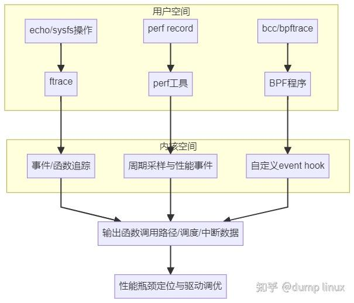
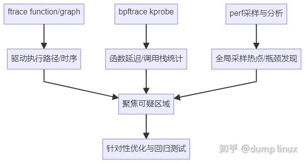

# 使用 ftrace / perf / BPF 分析驱动瓶颈

**Author:** dump linux

**Date:** 2025-07-22

**Link:** https://zhuanlan.zhihu.com/p/1929562440284246482

驱动写完却跑得慢怎么办？本节带你掌握 **Linux 内核性能分析“三件套”工具：ftrace、perf、[BPF](https://zhida.zhihu.com/search?content_id=260523752&content_type=Article&match_order=1&q=BPF&zhida_source=entity)**，帮助你快速定位：

-   驱动中最耗时的函数；
-   系统调度延迟和上下文切换；
-   中断/软中断/内核各类性能瓶颈。

## **核心概念与原理**

-   **ftrace = 内核内建的可插桩事件跟踪器（低侵入、高性能，用于函数、调度等 tracing）**
-   **perf = 支持内核与用户态的高分辨率采样（PMU硬件事件、system call、tracepoint等）**
-   **BPF ([eBPF](https://zhida.zhihu.com/search?content_id=260523752&content_type=Article&match_order=1&q=eBPF&zhida_source=entity)) = 通用高性能内核事件分析平台，支持自定义脚本和事件追踪，灵活插桩与动态统计**

它们可单独或组合使用，分析覆盖面更广。

## **一、技术流程总览**



## **二、ftrace：函数轨迹与行为追踪**

ftrace 为内核原生 tracing 框架，**无需第三方工具，仅需挂载 debugfs**。

### **1\. 基本启用步骤**

```bash
mount -t debugfs none /sys/kernel/debug
cd /sys/kernel/debug/tracing
```

### **2\. 跟踪特定函数执行序列**

```bash
echo function > current_tracer
echo uart_write > set_ftrace_filter   # 或支持通配："uart*"
echo 1 > tracing_on
​
# 触发串口相关操作
cat trace
​
# 关闭跟踪
echo 0 > tracing_on
```

> **提示**：建议用 set\_ftrace\_filter 精确匹配缩小追踪函数范围，否则可能有巨大输出且影响系统。

### **3\. 跟踪内核事件/调度/中断**

跟踪中断处理：

```bash
echo 'irq:irq_handler_entry' > set_event    # 格式为"group:event"
echo 1 > events/irq/irq_handler_entry/enable
```

查看上下文切换：

```bash
echo 'sched:sched_switch' > set_event
echo 1 > events/sched/sched_switch/enable
```

### **4\. ftrace 输出样例说明**

```text
     kworker/0:1-49   [000] .... 123.456789: uart_write <- tty_write
     kworker/0:1-49   [000] .... 123.456800: uart_start_tx <- uart_write
```

| 项 | 说明 |
| --- | --- |
| 进程名/ID | 当前执行的进程及其PID |
| [CPU] | 当前事件发生的CPU核 |
| 时间戳 | 事件绝对/相对时间 |
| 事件 | 当前函数trace情况 |

> 注：若kernel未编译调试符号，set\_ftrace\_filter 追踪部分函数将无效。

## **三、perf：高分辨率采样与火焰图分析**

perf 可统计硬件（PMU）与软件事件，适用于发现“热点”函数、CPU瓶颈、混合用户/内核调用链。

### **1\. 安装与基础用法（以Debian为例）**

```bash
sudo apt install linux-tools-common
sudo apt install linux-tools-$(uname -r)
perf record -a -g -- sleep 5     # 全局收集样本
perf report                      # 查看分析报告
```

### **2\. 针对驱动代码开展分析**

例如分析 SPI 内核驱动热点（采样内核态事件，勿加 ':u'）：

```bash
perf record -e cycles:k -g ./your_spi_test   # k = 内核态采样，默认含用户+内核
perf report -g tui                          # 推荐使用tui界面
```

> ⚠️ **注意**：内核热点函数分析须采集内核态事件，错误使用 -e cycles:u（用户态）将采集不到目标。

### **3\. 火焰图结合与高级用法**

```bash
perf script | stackcollapse-perf.pl | flamegraph.pl > flame.svg
```

（需安装 FlameGraph 工具集，详见 [FlameGraph](https://link.zhihu.com/?target=https%3A//github.com/brendangregg/Flamegraph) 文档）

## **四、eBPF/[bcc](https://zhida.zhihu.com/search?content_id=260523752&content_type=Article&match_order=1&q=bcc&zhida_source=entity)/bpftrace：灵活动态内核分析**

**eBPF** 是一个安全、灵活的内核沙盒，允许挂载小型自定义程序追踪函数/事件，广泛用于 trace、profile、网络与安全等领域。

-   “低侵入”而非“零影响”，插桩越多负载越高，部分功能依赖于 kernel 配置。
-   多数发行版需手动加载 kernel headers/开启 eBPF 功能。

### **1\. 安装 bcc 工具套件（Debian例）**

```bash
sudo apt install bpfcc-tools linux-headers-$(uname -r)
```

### **2\. 统计驱动函数延迟示例**

用 bcc 工具 **funclatency** 追踪内核函数：

```bash
sudo funclatency 'my_driver_func'
```

> 注：funclatency 适用于 kernel 函数插桩，不能对所有模块生效，并且精度受限于探针设计。

### **3\. 使用 bpftrace 扩展分析（如统计内核函数调用次数与栈）**

```bash
sudo bpftrace -e 'kprobe:spi_transfer { @[kstack] = count(); }'
```

> 最好结合条件过滤指定PID等，避免采集过多无关数据。更多脚本见 [bpftrace 参考](https://link.zhihu.com/?target=https%3A//github.com/iovisor/bpftrace/blob/master/docs/reference_guide.md)。

## **五、工具选型建议**

| 分析/场景 | 建议工具 | 说明 |
| --- | --- | --- |
| 内核驱动函数路径跟踪 | ftrace | 快速跟踪路径，定位大流程 |
| 热点函数与调度采样 | perf | 高效采样内核/用户/硬件热点 |
| 精确统计单函数/自定义事件 | eBPF (funclatency/bpftrace) | 可脚本化、按条件追踪与统计（支持过滤、定制） |
| 上下文切换/内核调度分析 | ftrace/perf/bpf | ftrace 直接支持 sched，perf亦可综合分析 |
| 复杂自定义 tracing | bpftrace / bcc | eBPF能力最强，支持复杂脚本与动态条件 |

## **六、工具协作分析流程示意图**



## **七、实用Tips与小结**

-   **ftrace**：轻量快速观测内核行为，推荐配合 set\_ftrace\_filter 精细追踪，避免大规模输出。
-   **perf**：发现热点、评估调度/内存/内核瓶颈，用report工具可图形界面交互分析，火焰图适合复杂栈统计。
-   **BPF生态**：灵活自定义追踪，支持聚合、过滤和高级事件捕捉。注意功能依赖内核编译配置与权限。
-   多工具组合分析更快定位实际性能问题，分析后建议结合代码/逻辑优化验证实际成效。