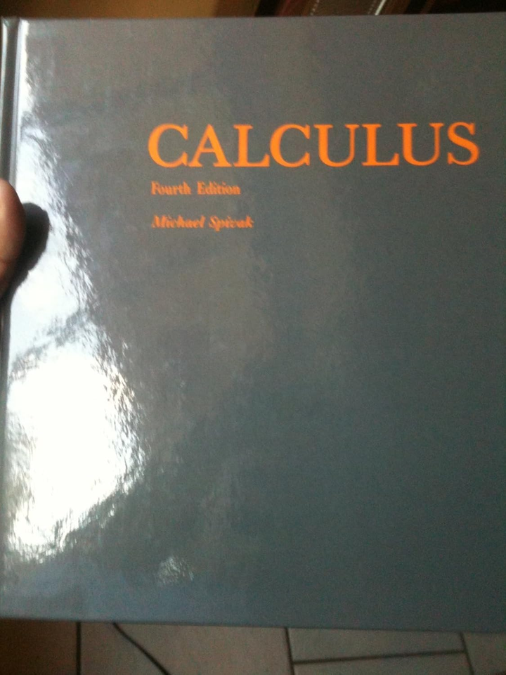
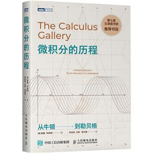
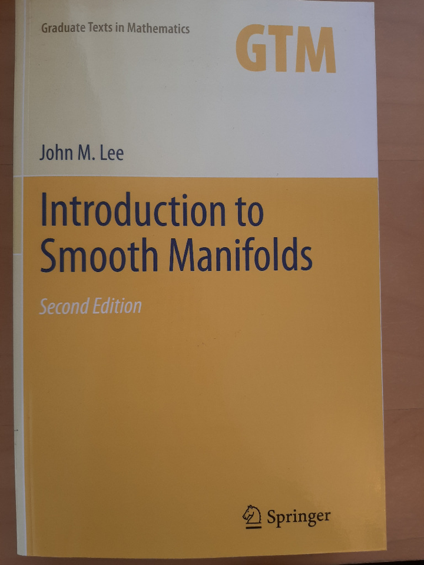

# 为什么几乎所有教科书上对微分的讲解都不明不白？

**Author:** CodeCrafter

**Date:** 2025-09-26

**Link:** https://www.zhihu.com/question/438795295/answer/1954844886101628439

好问题。

这个问题问到点子上了，绝对是国内数学教育里一个祖传的「坎」。

你觉得教科书讲不明白，根子不在你，在于**国内大部分《高等数学》或《微积分》教材，在「微分」这个概念上，试图把两种完全不同，甚至在历史上是互相对立的体系，强行缝合在一起，又不愿意花篇幅讲清楚它们的来龙去脉。**

哪两种体系？

1.  **历史的、直观的、物理学家的「[无穷小量](https://zhida.zhihu.com/search?content_id=749014879&content_type=Answer&match_order=1&q=%E6%97%A0%E7%A9%B7%E5%B0%8F%E9%87%8F&zhida_source=entity)」体系。**
2.  **现代的、严谨的、数学家的「[线性逼近](https://zhida.zhihu.com/search?content_id=749014879&content_type=Answer&match_order=1&q=%E7%BA%BF%E6%80%A7%E9%80%BC%E8%BF%91&zhida_source=entity)」体系。**

咱们国内的教科书，往往是用着第二种体系的严谨化定义（比如极限），但讲解和符号系统里，却大量残留着第一种体系的直观「感觉」。这就好比你拿到一个用现代分子料理技术做出来的汉堡，但说明书却用古代炼丹术的术语来写，什么「取太阳精粹之肉饼，辅以太阴凝露之酱汁」，能不懵吗？

下面我用大白话给你讲一下。

### d，dy，dx到底是个啥玩意儿？

我们必须在现代数学分析（也就是「线性逼近」体系）的框架下讨论这个问题，不然就又回到了三百年前的玄学争论里。

**1\. 先说 dx 是什么。**  
忘掉「无穷小增量」这个概念。在函数 `y = f(x)` 的微分里，`dx` **就是一个自变量，一个普通的实数，跟 x 本身没半毛钱关系。** 你可以把它当成 `h`，可以当成 `Δx`，它叫什么都行，它就是一个用来衡量变化的「尺子」。它的取值范围是整个实数域 `R`。对，你没看错，`dx` 可以等于1，可以等于-100，也可以等于π。它不是一个趋近于0的量。

**2\. 再说 dy 是什么。**  
`dy` 也不是「y的无穷小增量」。`dy` 是一个**因变量**，它的值依赖于 `x` 和 `dx`。`dy` 的**定义**是：  
`dy = f'(x) * dx`  
看清楚，这是一个**定义式**。`f'(x)` 是函数 `f` 在点 `x` 的导数，这是一个确定的数。所以，`dy` 本质上是一个关于 `x` 和 `d`x 的二元函数。更准确地说，在**固定**一个点 `x₀` 之后，`dy` 是一个**关于 `dx` 的线性函数**。它的图像是一条过原点的直线，斜率是 `f'(x₀)`。

**3\. 最后说 d 是什么。**  
`d` 是一个**运算符**，叫**[微分算子](https://zhida.zhihu.com/search?content_id=749014879&content_type=Answer&match_order=1&q=%E5%BE%AE%E5%88%86%E7%AE%97%E5%AD%90&zhida_source=entity)**。它作用在一个函数 `f` 上，会得到一个新的东西，叫 `df`。这个 `df` 是什么呢？它是一个**函数**，这个函数在每个点 `x` 的值，是那个点上的**线性映射**。  
听着有点晕？我换个说法：  
`d` 作用在 `f` 上，得到 `df`。  
`df` 在点 `x` 的值，记作 `df(x)` 或者 `d_x f`，它本身是一个线性函数，这个线性函数的功能是：你给它一个输入 `dx`，它就输出 `f'(x)dx`。  
所以 `dy = df(x)(dx) = f'(x)dx`。  
这个视角下，`d/dx` 这个符号就很好理解了，它就是把 `df` 这个函数除以 `dx` 这个函数（这里`dx`是恒等函数`g(x)=x`的微分，`g'(x)=1`，所以`dx = 1*dx`）。这个说法不完全严谨，但是能帮你直观理解。

**总结一下严谨的定义：**

-   `dx`：自变量的增量，一个独立的实数变量。
-   `dy`：函数增量 `Δy = f(x+dx) - f(x)` 的**线性主部**。当`dx`很小时，`Δy ≈ dy`。微分 `dy` 是对非线性的增量 `Δy` 的一个**线性近似**。这是微分的灵魂。
-   `d`：微分算子，它把一个函数映射到它的微分（一个线性映射场）。

你提到的多元函数中 `d` 是个标记，后面又变成运算符。没错，这正是概念混淆的重灾区。在多元函数 `z = f(x, y)` 中，`dz = (∂f/∂x)dx + (∂f/∂y)dy`。这里的 `dx` 和 `dy` 同样是**独立的实数变量**，分别代表在x方向和y方向的增量。`dz` 依然是全增量 `Δz` 的**线性主部**。这里的 `d` 依然是那个微分算子，只不过它作用在了多元函数上。

### 为什么教科书不这么清清楚楚地讲？

因为历史包袱太重了。

莱布尼茨当年引入 `dy/dx` 这套符号的时候，他脑子里想的就是无穷小量的比值。这套符号系统在计算上太强大、太符合直觉了，以至于物理、工程领域的人用了几百年，爽得飞起。比如链式法则 `dy/dx = (dy/du) * (du/dx)`，写成分数形式，就像可以约分一样，多直观！

后来柯西和魏尔斯特拉斯等人为了解决数学危机，用 `ε-δ` 语言建立了严格的极限理论，把无穷小量这个「幽灵」从数学分析里驱逐了出去。微分被重新定义为我们上面说的「线性逼近」。

但问题来了，`dy/dx` 这套符号已经深入人心，完全抛弃是不可能的。所以教科书就陷入了一个尴尬的境地：  
它想告诉你微分的本质是线性逼近（所以会有 `Δy = AΔx + o(Δx)` 这样的定义），但又想保留莱布尼茨符号的计算便利性。  
于是，它就在讲解 `dy`, `dx` 的时候，含含糊糊地说是「微小的增量」，让你往无穷小上靠拢，方便你直观理解和计算。但考试证明题的时候，又要求你用 `ε-δ` 或者线性逼近的定义，不承认无穷小。

这种教学上的「精神分裂」，导致了你的困惑。

### 在我们算法工程师眼里，微分意味着什么？

这个「线性逼近」的思想，在我的工作中几乎无处不在。我给你举个实际的例子。

**场景：优化一个深度学习模型。**  
一个神经网络，不管多复杂，本质上就是一个巨复杂的复合函数 `Loss = F(W)`，其中 `W` 是模型里成千上万甚至上亿的参数（权重）。我们的目标是找到一组 `W`，让 `Loss` 最小。

怎么找？用[梯度下降法](https://zhida.zhihu.com/search?content_id=749014879&content_type=Answer&match_order=1&q=%E6%A2%AF%E5%BA%A6%E4%B8%8B%E9%99%8D%E6%B3%95&zhida_source=entity)。也就是每次把 `W`朝着能让 `Loss` 下降最快的方向挪一小步。这个「最快的方向」，就是梯度的反方向，`-∇F(W)`。

梯度是什么？梯度就是由所有偏导数 `∂F/∂W_i` 组成的向量。而每个偏导数，本质上就是微分思想的体现。

当我们计算梯度时，我们实际上在做一件事情：在当前的参数点 `W` 附近，用一个\*\*线性函数（一个超平面）\*\*去近似 `Loss` 这个复杂的非线性函数。这个线性函数的斜率信息，就由梯度向量 `∇F(W)` 决定。  
`ΔLoss ≈ ∇F(W) ⋅ ΔW`  
这个公式，是不是和 `dy ≈ f'(x)dx` 长得一模一样？只不过是高维版本。  
`dy` 对应 `ΔLoss`，`f'(x)` 对应梯度 `∇F(W)`，`dx` 对应参数的微小变化 `ΔW`。

我们相信，只要 `ΔW` 足够小，这个线性近似就是可靠的。所以我们沿着 `-∇F(W)` 方向走一小步，就能保证 `Loss` 基本上是下降的。然后我们到了新的 `W'` 点，再在这个新点做一次线性近似，再走一小步…… 这就是梯度下降的本质。

整个现代AI的基石——**[反向传播算法](https://zhida.zhihu.com/search?content_id=749014879&content_type=Answer&match_order=1&q=%E5%8F%8D%E5%90%91%E4%BC%A0%E6%92%AD%E7%AE%97%E6%B3%95&zhida_source=entity)（Backpropagation）**，说白了就是应用链式法则高效计算这个巨复杂函数的梯度。它每一步计算的，都是函数在某个局部通过微分建立的线性关系。

如果脑子里想的是「无穷小」，那你很难理解为什么我们能用有限大小的「学习率」去乘以梯度来更新参数。但如果你理解了微分是「线性逼近」，一切就顺理成章了：我们就是在用一个局部最好的线性模型，来指导我们在非线性的复杂山谷里，一步步走到谷底。

### 关于高阶微分 dⁿy

你问的这个问题非常深刻。`dⁿy` 是一个更大的坑。  
对于一阶微分 `dy`，它有明确的几何意义：切线（或切平面）上的增量。  
但是二阶微分 `d²y` 呢？`d²y = d(dy) = d(f'(x)dx)`。根据乘法法则，这玩意儿展开会变成 `d(f'(x))dx + f'(x)d(dx) = f''(x)dx² + f'(x)d²x`。

在大多数初等微积分里，为了让 `d²y/dx² = f''(x)` 这个好看的等式成立，会**强行规定 `x` 是自变量时，`d²x = 0`**。这是一个非常粗暴且不讲道理的规定，纯粹是为了形式上的方便。

在更现代的微分几何语境下，高阶微分会涉及到更复杂的结构，比如「[射流丛](https://zhida.zhihu.com/search?content_id=749014879&content_type=Answer&match_order=1&q=%E5%B0%84%E6%B5%81%E4%B8%9B&zhida_source=entity)」(Jet bundle)，远远超出了初等微积分的范畴。

所以，给你的实用建议是：  
在学习《高等数学》这个阶段，**不要去深究 `d²y` 或 `dⁿy` 本身的独立含义**。就把 `dⁿy/dxⁿ` 看作一个**不可分割的整体符号**，它就等于 `f` 的 `n` 阶导数 `f⁽ⁿ⁾(x)`。这能帮你绕开绝大多数的认知障碍。等你以后学习[微分流形](https://zhida.zhihu.com/search?content_id=749014879&content_type=Answer&match_order=1&q=%E5%BE%AE%E5%88%86%E6%B5%81%E5%BD%A2&zhida_source=entity)之类的课程，再回过头来重新审视它。

如果你真的想把这个根子上的问题彻底搞懂，我推荐你跳出国内教材的思维定式，去看一些好的资源。下载地址：[推荐几本冷门但是含金量极高的微积分读本（附PDF下载）](https://link.zhihu.com/?target=https%3A//mp.weixin.qq.com/s/P4idG0H_PVN7DpmK-sDPeg)，我再来详细介绍下：

**打好基础，看思想源头：**

**《Calculus》 by Michael Spivak**： 这本书是数学系本科一年级的经典分析入门教材。它从最基本的`ε-δ`语言出发，非常严谨地构建了整个微积分体系。关于微分，它会让你彻底明白什么是「线性逼近」。看完这本书，你对微分的理解会上升一个层次。

**《普林斯顿微积分读本》**：如果觉得Spivak太难，这本书是一个非常好的过渡。它讲得非常直观，同时又不失严谨，会把很多概念背后的思想给你讲透。

**换个视角，看现代观点：**

**《微积分的历程：从牛顿到勒贝格》**：这本书能帮你理清微积分发展的历史脉络，让你明白为什么会有「无穷小」和「极限」两种体系的斗争和演变。理解了历史，很多困惑就迎刃而解了。

如果未来有兴趣，可以看看**微分流形**的入门书籍，比如 **《Introduction to Smooth Manifolds》 by John M. Lee**。在这里，`d` 会被正式定义为**[外微分算子](https://zhida.zhihu.com/search?content_id=749014879&content_type=Answer&match_order=1&q=%E5%A4%96%E5%BE%AE%E5%88%86%E7%AE%97%E5%AD%90&zhida_source=entity)**，你会看到一个无比和谐与强大的数学体系，之前所有的困惑都会烟消云散。

作为一名在数学之路上探索踩坑了很久的人，深知优质教材对于数学学习非常重要。因此，精心搜集了76本国外经典数学教材，涵盖代数、几何、分析、概率等多个数学分支，希望能帮助热爱数学的同学们构建更完善的知识体系。

[76本国外经典教材，全方位覆盖代数、几何、分析、概率等核心领域（附PDF下载）](https://link.zhihu.com/?target=https%3A//mp.weixin.qq.com/s/N3ih904eGewoWD7Bs09x8Q)

此外，见证国内数学学科发展的“活化石”，科学出版社的《现代数学基础丛书》自1981年诞生以来，已持续更新至204卷，堪称中国数学界的“四库全书”，也一并整理好了。

[5000字硬核盘点！《现代数学基础丛书》204卷必读清单（附PDF及领域分类），建议收藏备用 ！](https://link.zhihu.com/?target=https%3A//mp.weixin.qq.com/s/wnbTRfVYKb8CTpg7eLirUQ)

你觉得教科书讲得不明不白，这恰恰说明你的数学品味很好，你在追求一种逻辑上的和谐与自洽。这不是钻牛角尖，这是学好数学（以及任何硬核科学）最宝贵的品质。

不要把 `dy`, `dx` 当作某种神秘的、需要「意会」的东西。在现代数学里，每一个符号都有它精确的、冰冷的定义。只不过我们现在的入门教材，为了所谓的「降低难度」，把这些定义背后的道理给阉割了，给你留下了一堆看似直观却充满矛盾的「规矩」。

忘掉无穷小，拥抱线性逼近。这是你捅破这层窗户纸的关键。